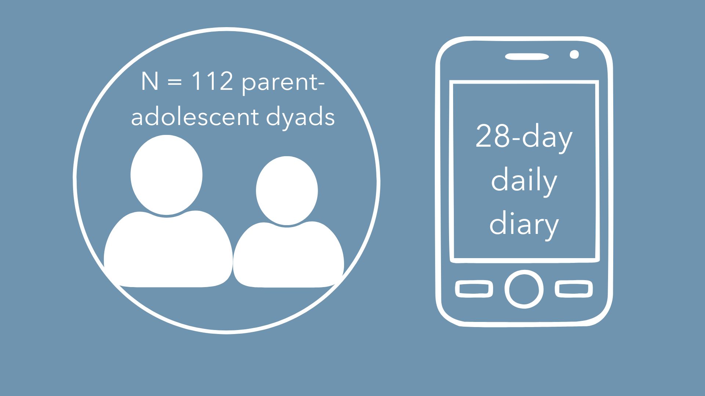
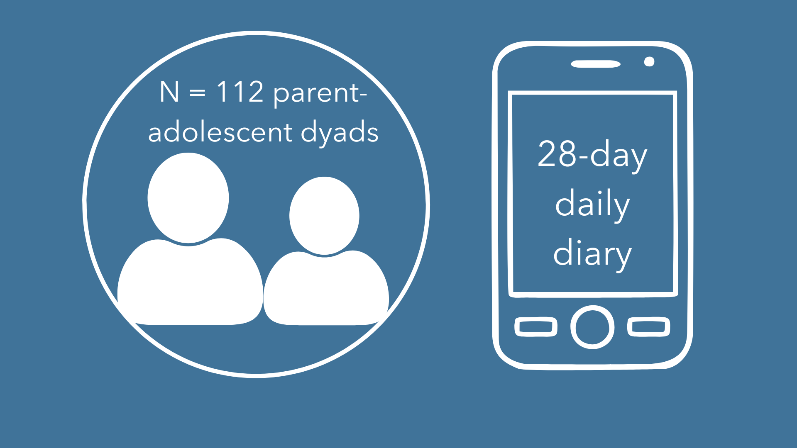

```{r}
library(tidyverse)
library(dplyr)
library(performance)
library(RColorBrewer)
library(modelsummary)
library(ggridges)
library(patchwork)
library(colorspace)
library(broom)
```

```{r}
df <- read.csv("dyad_mean_data_all2.csv")
```

```{r}
#| output: false
## PROBLEM SOLVING
rq1a_problem_solving <- lm(
  ad_inter_problem_solving_avg ~ par_inter_problem_solving_avg +
    ad_age + ad_gender + time_spent_avg + par_negative_affect + ad_negative_affect,
  data = df
)
summary(rq1a_problem_solving)

## CORUMINATION
rq1a_corumination <- lm(
  ad_inter_corumination_avg ~ par_inter_corumination_avg +
    ad_age + ad_gender + time_spent_avg + par_negative_affect + ad_negative_affect,
  data = df
)
summary(rq1a_corumination)

## REAPPRAISAL
rq1a_reappraisal <- lm(
  ad_inter_reappraisal_avg ~ par_inter_reappraisal_avg +
    ad_age + ad_gender + time_spent_avg + par_negative_affect + ad_negative_affect,
  data = df
)
summary(rq1a_reappraisal)

## ACCEPTANCE
rq1a_acceptance <- lm(
  ad_inter_acceptance_avg ~ par_inter_acceptance_avg +
    ad_age + ad_gender + time_spent_avg + par_negative_affect + ad_negative_affect,
  data = df
)
summary(rq1a_acceptance)

## DISTRACTION
rq1a_distraction <- lm(
  ad_inter_distraction_avg ~ par_inter_distraction_avg +
    ad_age + ad_gender + time_spent_avg + par_negative_affect + ad_negative_affect,
  data = df
)
summary(rq1a_distraction)

## SUPPRESSION
rq1a_suppression <- lm(
  ad_inter_suppression_avg ~ par_inter_suppression_avg +
    ad_age + ad_gender + time_spent_avg + par_negative_affect + ad_negative_affect,
  data = df
)
summary(rq1a_suppression)
```

```{r}
#| output: false
modelsummary(
  list(
    "problem solving" = rq1a_problem_solving,
    "corumination"    = rq1a_corumination,
    "reappraisal"     = rq1a_reappraisal,
    "acceptance"      = rq1a_acceptance,
    "distraction"     = rq1a_distraction,
    "suppression"     = rq1a_suppression
  ),
  stars = TRUE,
  title = "RQ1a: Inter-personal ER strategy use similarity across the daily diary period",
  notes = "All models adjust for adolescent age, gender, time spent together, parent NA, and adolescent NA"
)

rq1a_models <- list(
  problem_solving = rq1a_problem_solving,
  corumination    = rq1a_corumination,
  reappraisal     = rq1a_reappraisal,
  acceptance      = rq1a_acceptance,
  distraction     = rq1a_distraction,
  suppression     = rq1a_suppression
)

rq1a_preds <- c(
  "par_inter_problem_solving_avg",
  "par_inter_corumination_avg",
  "par_inter_reappraisal_avg",
  "par_inter_acceptance_avg",
  "par_inter_distraction_avg",
  "par_inter_suppression_avg"
)

rq1a_tests <- data.frame(
  model     = names(rq1a_models),
  predictor = rq1a_preds,
  stringsAsFactors = FALSE
)

rq1a_tests$p_raw <- mapply(function(m, p) {
  coef(summary(rq1a_models[[m]]))[p, "Pr(>|t|)"]
}, rq1a_tests$model, rq1a_tests$predictor)

rq1a_tests <- rq1a_tests %>%
  mutate(
    p_fdr  = p.adjust(p_raw, method = "BH"),
    signif = p_fdr < 0.05
  )

print(rq1a_tests)
modelsummary(
  list(
    "problem solving" = rq1a_problem_solving,
    "corumination"    = rq1a_corumination,
    "reappraisal"     = rq1a_reappraisal,
    "acceptance"      = rq1a_acceptance,
    "distraction"     = rq1a_distraction,
    "suppression"     = rq1a_suppression
  ),
  stars = TRUE,
  title = "RQ1a: Inter-personal ER strategy use similarity across the daily diary period",
  notes = "All models adjust for adolescent age, gender, time spent together, parent NA, and adolescent NA"
)

rq1a_models <- list(
  problem_solving = rq1a_problem_solving,
  corumination    = rq1a_corumination,
  reappraisal     = rq1a_reappraisal,
  acceptance      = rq1a_acceptance,
  distraction     = rq1a_distraction,
  suppression     = rq1a_suppression
)

rq1a_preds <- c(
  "par_inter_problem_solving_avg",
  "par_inter_corumination_avg",
  "par_inter_reappraisal_avg",
  "par_inter_acceptance_avg",
  "par_inter_distraction_avg",
  "par_inter_suppression_avg"
)

rq1a_tests <- data.frame(
  model     = names(rq1a_models),
  predictor = rq1a_preds,
  stringsAsFactors = FALSE
)

rq1a_tests$p_raw <- mapply(function(m, p) {
  coef(summary(rq1a_models[[m]]))[p, "Pr(>|t|)"]
}, rq1a_tests$model, rq1a_tests$predictor)

rq1a_tests <- rq1a_tests %>%
  mutate(
    p_fdr  = p.adjust(p_raw, method = "BH"),
    signif = p_fdr < 0.05
  )

print(rq1a_tests)
```

```{r}
#| output: false
## RQ2a: Intra-personal ER strategy use similarity across the daily diary period

## PROBLEM SOLVING
rq2a_problem_solving <- lm(
  ad_intra_problem_solving_avg ~ par_intra_problem_solving_avg +
    ad_age + ad_gender + time_spent_avg + par_negative_affect + ad_negative_affect,
  data = df
)
summary(rq2a_problem_solving)

## RUMINATION
rq2a_rumination <- lm(
  ad_intra_rumination_avg ~ par_intra_rumination_avg +
    ad_age + ad_gender + time_spent_avg + par_negative_affect + ad_negative_affect,
  data = df
)
summary(rq2a_rumination)

## REAPPRAISAL
rq2a_reappraisal <- lm(
  ad_intra_reappraisal_avg ~ par_intra_reappraisal_avg +
    ad_age + ad_gender + time_spent_avg + par_negative_affect + ad_negative_affect,
  data = df
)
summary(rq2a_reappraisal)

## ACCEPTANCE
rq2a_acceptance <- lm(
  ad_intra_acceptance_avg ~ par_intra_acceptance_avg +
    ad_age + ad_gender + time_spent_avg + par_negative_affect + ad_negative_affect,
  data = df
)
summary(rq2a_acceptance)

## DISTRACTION
rq2a_distraction <- lm(
  ad_intra_distraction_avg ~ par_intra_distraction_avg +
    ad_age + ad_gender + time_spent_avg + par_negative_affect + ad_negative_affect,
  data = df
)
summary(rq2a_distraction)

## SUPPRESSION
rq2a_suppression <- lm(
  ad_intra_suppression_avg ~ par_intra_suppression_avg +
    ad_age + ad_gender + time_spent_avg + par_negative_affect + ad_negative_affect,
  data = df
)
summary(rq2a_suppression)
```

```{r}
#| output: false

modelsummary(
  list(
    "problem solving" = rq2a_problem_solving,
    "rumination"      = rq2a_rumination,
    "reappraisal"     = rq2a_reappraisal,
    "acceptance"      = rq2a_acceptance,
    "distraction"     = rq2a_distraction,
    "suppression"     = rq2a_suppression
  ),
  stars = TRUE,
  title = "RQ2a: Intra-personal ER strategy use similarity across the daily diary period",
  notes = "All models adjust for adolescent age, gender, time spent together, parent NA, and adolescent NA"
)

rq2a_models <- list(
  problem_solving = rq2a_problem_solving,
  rumination      = rq2a_rumination,
  reappraisal     = rq2a_reappraisal,
  acceptance      = rq2a_acceptance,
  distraction     = rq2a_distraction,
  suppression     = rq2a_suppression
)

rq2a_preds <- c(
  "par_intra_problem_solving_avg",
  "par_intra_rumination_avg",
  "par_intra_reappraisal_avg",
  "par_intra_acceptance_avg",
  "par_intra_distraction_avg",
  "par_intra_suppression_avg"
)

rq2a_tests <- data.frame(
  model     = names(rq2a_models),
  predictor = rq2a_preds,
  stringsAsFactors = FALSE
)

rq2a_tests$p_raw <- mapply(function(m, p) {
  coef(summary(rq2a_models[[m]]))[p, "Pr(>|t|)"]
}, rq2a_tests$model, rq2a_tests$predictor)

rq2a_tests$p_fdr  <- p.adjust(rq2a_tests$p_raw, method = "BH")
rq2a_tests$signif <- rq2a_tests$p_fdr < 0.05

print(rq2a_tests)
```

```{r}
#| output: false

## RQ3a: Parent interpersonal ER predicts adolescent intrapersonal ER (analogous)

## PROBLEM SOLVING
rq3a_problem_solving <- lm(
  ad_intra_problem_solving_avg ~ par_inter_problem_solving_avg +
    ad_age + ad_gender + time_spent_avg + par_negative_affect + ad_negative_affect,
  data = df
)
summary(rq3a_problem_solving)

## RUMINATION
rq3a_rumination <- lm(
  ad_intra_rumination_avg ~ par_inter_corumination_avg +
    ad_age + ad_gender + time_spent_avg + par_negative_affect + ad_negative_affect,
  data = df
)
summary(rq3a_rumination)

## REAPPRAISAL
rq3a_reappraisal <- lm(
  ad_intra_reappraisal_avg ~ par_inter_reappraisal_avg +
    ad_age + ad_gender + time_spent_avg + par_negative_affect + ad_negative_affect,
  data = df
)
summary(rq3a_reappraisal)

## ACCEPTANCE
rq3a_acceptance <- lm(
  ad_intra_acceptance_avg ~ par_inter_acceptance_avg +
    ad_age + ad_gender + time_spent_avg + par_negative_affect + ad_negative_affect,
  data = df
)
summary(rq3a_acceptance)

## DISTRACTION
rq3a_distraction <- lm(
  ad_intra_distraction_avg ~ par_inter_distraction_avg +
    ad_age + ad_gender + time_spent_avg + par_negative_affect + ad_negative_affect,
  data = df
)
summary(rq3a_distraction)

## SUPPRESSION
rq3a_suppression <- lm(
  ad_intra_suppression_avg ~ par_inter_suppression_avg +
    ad_age + ad_gender + time_spent_avg + par_negative_affect + ad_negative_affect,
  data = df
)
summary(rq3a_suppression)

```

```{r}
#| output: false
modelsummary(
  list(
    "problem solving" = rq3a_problem_solving,
    "corumination"    = rq3a_rumination,
    "reappraisal"     = rq3a_reappraisal,
    "acceptance"      = rq3a_acceptance,
    "distraction"     = rq3a_distraction,
    "suppression"     = rq3a_suppression
  ),
  stars = TRUE,
  title = "RQ3a: Mean-level associations between parent interpersonal and adolescent intrapersonal ER",
  notes = "All models adjust for adolescent age, gender, time spent together, parent NA, and adolescent NA"
)

rq3a_models <- list(
  problem_solving = rq3a_problem_solving,
  corumination    = rq3a_rumination,
  reappraisal     = rq3a_reappraisal,
  acceptance      = rq3a_acceptance,
  distraction     = rq3a_distraction,
  suppression     = rq3a_suppression
)

rq3a_preds <- c(
  "par_inter_problem_solving_avg",
  "par_inter_corumination_avg",
  "par_inter_reappraisal_avg",
  "par_inter_acceptance_avg",
  "par_inter_distraction_avg",
  "par_inter_suppression_avg"
)

rq3a_tests <- data.frame(
  model = names(rq3a_models),
  predictor = rq3a_preds,
  stringsAsFactors = FALSE
)

rq3a_tests$p_raw <- mapply(function(m, p) {
  coef(summary(rq3a_models[[m]]))[p, "Pr(>|t|)"]
}, rq3a_tests$model, rq3a_tests$predictor)

rq3a_tests <- rq3a_tests %>%
  mutate(
    p_fdr  = p.adjust(p_raw, method = "BH"),
    signif = p_fdr < 0.05
  )

print(rq3a_tests)
```


```{r}
  viz1theme <- function(base_family = "Avenir") {
    theme_classic(base_family = base_family) +
      theme(
        plot.title = element_text(size = 16.5, face = "bold", hjust = 0.5),
        axis.title = element_text(size = 14.5, face = "bold"),
        axis.text = element_text(size = 12),
        plot.background = element_rect(fill = "white", color = NA),
        legend.position = "none"                          
      )
      }

```

# {.sidebar}


Strategies and example items are as follows:

**Reappraisal**
<details>

  **Definition**: reframing an situation to alter its emotional impact
  
  • **Interpersonal:** *I helped my child/parent think of the situation in a positive light.*
  
  • **Intrapersonal:** *I tried to think of the problem in a different way so it didn't seem as bad.*

</details>

**Suppression**
<details>

  **Definition**: repressing the outward expression of an emotion

  • **Intrapersonal:** *I controlled my feelings by not showing them.*
  
  • **Interpersonal:** *I helped my child/parent try to hide their feelings from others*
</details>

  
**(Co)rumination**
<details>

  **Definition**: verbally or internally revisiting an emotion-eliciting event

  • **Intrapersonal:** *I thought, "I'm ruining everything."*
  
  • **Interpersonal:** *I helped my child/parent replay the experience of negative feelings again and again in their mind*
</details>

  
**Acceptance**
<details>

  **Definition**: acknowledging and feeling the emotion without judgment

  • **Intrapersonal:** *I accepted my feelings without trying to change them.*
  
  • Interpersonal: *I helped my child/parent accept their negative feelings.*
</details>

**Distraction**
<details>

  **Definition**: engaging in an enjoyable activity 
  
  • **Intrapersonal:** *I did something I enjoy.*
  
  • **Interpersonal:** *I helped my child/parent find ways to distract themselves from their negative feelings*
</details>

**Problem solving** 
<details>

  **Definition**: coming up with a solution to the problem underlying an emotion

  • **Intrapersonal:** *I thought of a way to make my problem better.*
  
  • **Interpersonal:** *I helped my child/parent think of solutions to their problems.*
</details>


# Welcome

Welcome to my data dashboard! This page displays visualizations for an ongoing project which aims to quantify within-dyad associations in **interpersonal emotion regulation** (i.e., strategies used to regulate others' emotions) and **intrapersonal emotion regulation** (i.e., strategies used to regulate one's own emotions). 

## Row

### Column


{position="center"}

**Data Description**

Each evening, adolescents and their parents completed a **daily diary** reporting on their current emotions, their partner's peak emotions, and the intrapersonal and interpersonal strategies they used. This study focuses in particular on six strategies which have *analogous interpersonal and intrapersonal forms:* **reappraisal, suppression, (co)rumination, acceptance, distraction,** and **problem solving** (see sidebar for detail).


### Column

**Research Questions**

• *RQ1*: Are parents’ and adolescents’ use of *intrapersonal* ER strategies associated at the individual strategy level? 

• *RQ2*: Are parents’ and adolescents’ use of *interpersonal* ER strategies associated at the individual strategy level? 

• *RQ3*: Are parents’ use of interpersonal ER strategies associated with adolescents’ use of the analogous intrapersonal strategies (*modeling*)? 

# Strategy Use: Distributions of Individual's Average Strategy Use

::: {.panel-tabset}
## Intrapersonal ER 
```{r}
ad_intra <- df %>%
  pivot_longer(
    cols = starts_with("ad_intra_"),
    names_to = "strategy",
    values_to = "value"
  ) %>%
  ggplot(aes(x = value, y = strategy, fill=strategy)) +
   scale_y_discrete(labels = c(
    "ad_intra_problem_solving_avg" = "Problem Solving",
    "ad_intra_rumination_avg"      = "Rumination",
    "ad_intra_reappraisal_avg"     = "Reappraisal",
    "ad_intra_acceptance_avg"      = "Acceptance",
    "ad_intra_distraction_avg"     = "Distraction",
    "ad_intra_suppression_avg"     = "Suppression"
  ), expand = c(0.01, 0)) +
  geom_density_ridges(alpha = .7, scale = 1.7) +
  labs(x = "Average Strategy Use",
       y = "Intrapersonal Strategy",
       title = "Adolescent") +
  scale_x_continuous(expand = c(0.01, 0)) +
  viz1theme() +
  theme(legend.position = "none", axis.title.y = element_blank(),
        axis.text.y = element_blank(),
        axis.ticks.y = element_blank(), axis.title.x = element_blank()) +
  scale_fill_brewer(palette="Set2")

par_intra <- df %>%
  pivot_longer(
    cols = starts_with("par_intra_"),
    names_to = "strategy",
    values_to = "value"
  ) %>%
  ggplot(aes(x = value, y = strategy, fill=strategy)) +
  scale_y_discrete(labels = c(
    "par_intra_problem_solving_avg" = "Problem Solving",
    "par_intra_rumination_avg"      = "Rumination",
    "par_intra_reappraisal_avg"     = "Reappraisal",
    "par_intra_acceptance_avg"      = "Acceptance",
    "par_intra_distraction_avg"     = "Distraction",
    "par_intra_suppression_avg"     = "Suppression"
  ), expand = c(0.01, 0)) +
  geom_density_ridges(alpha = .7, scale = 1.7) +
  labs(x = "Individuals' Average Strategy Use across the Daily Diary Period",
       y = "Intrapersonal Strategy",
       title = "Parent") +
  scale_x_continuous(expand = c(0.01, 0)) +
  viz1theme() + 
  scale_fill_brewer(palette="Set2") +
  theme(legend.position = "none",    axis.title.x = element_text(
      hjust = 0, vjust = -1,margin = margin(t = 10)))


(par_intra + ad_intra) + plot_annotation(title="Parents and adolescents both use a variety of strategies\nto regulate their own's emotions", subtitle="Parents use slightly more reappraisal, problem solving, and acceptance", theme=theme(plot.title = element_text(family = "Avenir", face = "bold", size = 18, hjust = 0.5), plot.subtitle = element_text(family = "Avenir", face = "italic", size = 16, hjust = 0.5)))
```
## Interpersonal ER 

```{r}
ad_inter <- df %>%
  pivot_longer(
    cols = starts_with("ad_inter_"),
    names_to = "strategy",
    values_to = "value"
  ) %>%
  ggplot(aes(x = value, y = strategy, fill=strategy)) +
  scale_y_discrete(labels = c(
    "ad_inter_problem_solving_avg" = "Problem Solving",
    "ad_inter_corumination_avg"    = "Corumination",
    "ad_inter_reappraisal_avg"     = "Reappraisal",
    "ad_inter_acceptance_avg"      = "Acceptance",
    "ad_inter_distraction_avg"     = "Distraction",
    "ad_inter_suppression_avg"     = "Suppression"
  ), expand = c(0.01, 0)) +
  geom_density_ridges(alpha = .7, scale = 1.7) +
  labs(x = "Individuals' Average Strategy Use across the Daily Diary Period",
       y = "Interpersonal Strategy",
       title = "Adolescent") +
  scale_x_continuous(expand = c(0.01, 0)) +
  viz1theme() +
  theme(legend.position = "none", axis.title.y = element_blank(),
        axis.text.y = element_blank(),
        axis.ticks.y = element_blank(), axis.title.x = element_blank()) +
  scale_fill_brewer(palette="Set2") 

par_inter <- df %>%
  pivot_longer(
    cols = starts_with("par_inter_"),
    names_to = "strategy",
    values_to = "value"
  ) %>%
  ggplot(aes(x = value, y = strategy, fill=strategy)) +
     scale_y_discrete(labels = c(
    "par_inter_problem_solving_avg" = "Problem Solving",
    "par_inter_corumination_avg"    = "Corumination",
    "par_inter_reappraisal_avg"     = "Reappraisal",
    "par_inter_acceptance_avg"      = "Acceptance",
    "par_inter_distraction_avg"     = "Distraction",
    "par_inter_suppression_avg"     = "Suppression"
  ), expand = c(0.01, 0)) +
  geom_density_ridges(alpha = .7, scale = 1.7) +
  labs(x = "Individuals' Average Strategy Use across the Daily Diary Period",
       y = "Interpersonal Strategy",
       title = "Parent") +
  scale_x_continuous(expand = c(0.01, 0)) +
  scale_fill_brewer(palette="Set2") +
  viz1theme() +
  theme(legend.position = "none",    axis.title.x = element_text(
      hjust = 0, vjust = -1,margin = margin(t = 10)))


(par_inter + ad_inter) + plot_annotation(title="Parents and adolescents both use a variety of strategies\nto regulate one another's emotions", subtitle="Parents use more interpersonal emotion regulation overall", theme=theme(plot.title = element_text(family = "Avenir", face = "bold", size = 18, hjust = 0.5), plot.subtitle = element_text(family = "Avenir", face = "italic", size = 16, hjust = 0.5)))
```
:::

This page displays distributions for parents' and adolescents' use of each interpersonal and intrapersonal ER strategy. Overall, parents and adolescents report using a variety of strategies, with parents appearing to use more interpersonal strategies than adolescents.


```{r}
names1 <- c(
  problem_solving = "Problem Solving",
  corumination    = "Corumination",
  reappraisal     = "Reappraisal",
  acceptance      = "Acceptance",
  distraction     = "Distraction",
  suppression     = "Suppression"
)

names2 <- c(
  problem_solving = "Problem Solving",
  corumination    = "Rumination",
  reappraisal     = "Reappraisal",
  acceptance      = "Acceptance",
  distraction     = "Distraction",
  suppression     = "Suppression"
)

betas1 <- c(
  problem_solving = coef(rq1a_problem_solving)["par_inter_problem_solving_avg"],
  corumination    = coef(rq1a_corumination)["par_inter_corumination_avg"],
  reappraisal     = coef(rq1a_reappraisal)["par_inter_reappraisal_avg"],
  acceptance      = coef(rq1a_acceptance)["par_inter_acceptance_avg"],
  distraction     = coef(rq1a_distraction)["par_inter_distraction_avg"],
  suppression     = coef(rq1a_suppression)["par_inter_suppression_avg"]
)

betas2 <- c(
  problem_solving = coef(rq2a_problem_solving)["par_intra_problem_solving_avg"],
  rumination      = coef(rq2a_rumination)["par_intra_rumination_avg"],
  reappraisal     = coef(rq2a_reappraisal)["par_intra_reappraisal_avg"],
  acceptance      = coef(rq2a_acceptance)["par_intra_acceptance_avg"],
  distraction     = coef(rq2a_distraction)["par_intra_distraction_avg"],
  suppression     = coef(rq2a_suppression)["par_intra_suppression_avg"]
)

betas3 <- c(
  problem_solving = coef(rq3a_problem_solving)["par_inter_problem_solving_avg"],
  corumination    = coef(rq3a_rumination)["par_inter_corumination_avg"],
  reappraisal     = coef(rq3a_reappraisal)["par_inter_reappraisal_avg"],
  acceptance      = coef(rq3a_acceptance)["par_inter_acceptance_avg"],
  distraction     = coef(rq3a_distraction)["par_inter_distraction_avg"],
  suppression     = coef(rq3a_suppression)["par_inter_suppression_avg"]
)

df1 <- data.frame(
  label = names1,
  beta  = as.numeric(betas1)
)
df2 <- data.frame(
  label = names2,
  beta  = as.numeric(betas2)
)
df3 <- data.frame(
  label = names1,
  beta  = as.numeric(betas3)
)
```

# Regression Results: Highlighting Significance

This page compares the magnitude of the coefficients, with significant associations (p < .05 after correcting for multiple comparisons) highlighted in blue.

::: {.panel-tabset}

## RQ1: Intrapersonal Correspondence

```{r}
rq1chart <- ggplot(df2,
       aes(x = beta,
           y = reorder(label, abs(beta)))) +
  geom_col(fill="gray80") +
  geom_text(aes(label = paste0(round(beta, 3))), hjust = 1.5, size = 6) +
   labs(title = "Parents' and Adolescents' Intrapersonal Strategy Use is Not \nAssociated Across the Daily Diary Period",
    x = "Beta",
    y = "Intrapersonal ER Strategy",
    caption = expression("* " * italic(p) * " < .05")
  ) +
  scale_x_continuous(expand = c(0.01, 0)) +
  scale_y_discrete(expand = c(0.01, 0)) +
  viz1theme()

print(rq1chart)


```

Across six strategies, parents' and adolescents' intrapersonal emotion regulation strategy use was *not* associated across the daily diary period.

## RQ2: Interpersonal Correspondence

```{r}
rq2chart <- ggplot(df1,
       aes(x = beta,
           y = reorder(label, abs(beta)))) +
  geom_col(fill="gray80") +
  geom_col(data=filter(df1, label %in% c("Corumination","Distraction","Suppression")), fill="deepskyblue3") +
  geom_text(aes(label = paste0(round(beta, 3), ifelse(label %in% c("Corumination","Distraction","Suppression"), "*", ""))), hjust = 1.2, size = 6) +
   labs(
    title = "Parents' and Adolescents' Use of Interpersonal Suppression, \nDistraction, and Corumination was Positively Associated",
    x = "Beta",
    y = "Interpersonal ER Strategy",
    caption = expression("* " * italic(p) * " < .05")
  ) +
  scale_x_continuous(expand = c(0.01, 0)) +
  scale_y_discrete(expand = c(0.01, 0)) +
  viz1theme()

print(rq2chart)

```

Parents' and adolscents use of interpersonal corumination, distraction, and suppression was significantly associated across the daily diary period.

## RQ3: Parent Modeling

```{r}
rq3chart <- ggplot(df3,
       aes(x = beta,
           y = reorder(label, abs(beta)))) +
  geom_col(fill="gray80") +
  geom_col(data=filter(df3, label %in% c("Corumination")), fill="deepskyblue3") +
  geom_text(aes(label = paste0(round(beta, 3), ifelse(label %in% c("Corumination"), "*", ""))), hjust = 1.5, size = 6) +
   labs(
     title = "Parents' use of Corumination was Associated with Adolescents' \nUse of Intrapersonal Rumination",
    x = "Beta",
    y = "Interpersonal ER Strategy",
    caption = expression("* " * italic(p) * " < .05")
  ) +
  scale_x_continuous(expand = c(0.01, 0)) +
  scale_y_discrete(expand = c(0.01, 0)) +
  viz1theme()

print(rq3chart)
```

Parents' use of corumination was a significant predictor of adolescents' use of rumination across the daily diary period, pointing to the unique salience of corumination as an interpersonal emotion regulation strategy.

:::

# Regression Results: Displaying Uncertainty

::: {.panel-tabset}

## RQ1: Intrapersonal Correspondence


```{r}
tidy_rq2 <- map2_dfr(names(rq2a_models), rq2a_preds, function(m, p) {
  broom::tidy(rq2a_models[[m]], conf.int = TRUE) %>%
    filter(term == p) %>%
    mutate(strategy = m,
           signif = p.value < 0.05)
})

tidy_rq2 <- tidy_rq2 %>%
  mutate(strategy_clean = factor(strategy,
  levels = c("suppression", "distraction", "rumination", "reappraisal", "problem_solving", "acceptance"),
  labels = c("Suppression", "Distraction", "Rumination", "Reappraisal", "Problem Solving", "Acceptance")))

ggplot(tidy_rq2, aes(x = estimate, y = reorder(strategy_clean, estimate))) +
  geom_vline(xintercept = 0, color = "cornflowerblue", linetype = 2) +
  geom_errorbar(aes(xmin = estimate + qnorm(.025)*std.error, 
                    xmax = estimate + qnorm(.975)*std.error),
                color = lighten("#4375D3", .6),
                width = 0.2,
                size = 0.8) + # 95% CI
  geom_errorbar(aes(xmin = estimate + qnorm(.05)*std.error, 
                    xmax = estimate + qnorm(.95)*std.error),
                color = lighten("#4375D3", .3),
                width = 0.2,
                size = 1.2) + # 90% CI
  geom_errorbar(aes(xmin = estimate + qnorm(.1)*std.error, 
                    xmax = estimate + qnorm(.9)*std.error),
                color = "#4375D3",
                width = 0.2,
                size = 1.6) + # 80% CI
  geom_point(size = 3) +
  labs(title = "Parents' and Adolescents' Use of Intrapersonal Strategies \nwas not Associated",
    x = "Coefficient",
    y = "Intrapersonal ER Strategy",
    caption = "Standard error bars indicate 95%, 90%, and 80% confidence intervals.") +
  viz1theme()

```


## RQ2: Interpersonal Correspondence

```{r}
tidy_rq1 <- map2_dfr(names(rq1a_models), rq1a_preds, function(m, p) {
  broom::tidy(rq1a_models[[m]], conf.int = TRUE) %>%
    filter(term == p) %>%
    mutate(strategy = m,
           signif = p.value < 0.05)
})

tidy_rq1 <- tidy_rq1 %>%
  mutate(strategy_clean = factor(strategy,
  levels = c("suppression", "distraction", "corumination", "reappraisal", "problem_solving", "acceptance"),
  labels = c("Suppression", "Distraction", "Corumination", "Reappraisal", "Problem Solving", "Acceptance")))

ggplot(tidy_rq1, aes(x = estimate, y = reorder(strategy_clean, estimate))) +
  geom_vline(xintercept = 0, color = "cornflowerblue", linetype = 2) +
  geom_errorbar(aes(xmin = estimate + qnorm(.025)*std.error, 
                    xmax = estimate + qnorm(.975)*std.error),
                color = lighten("#4375D3", .6),
                width = 0.2,
                size = 0.8) + # 95% CI
  geom_errorbar(aes(xmin = estimate + qnorm(.05)*std.error, 
                    xmax = estimate + qnorm(.95)*std.error),
                color = lighten("#4375D3", .3),
                width = 0.2,
                size = 1.2) + # 90% CI
  geom_errorbar(aes(xmin = estimate + qnorm(.1)*std.error, 
                    xmax = estimate + qnorm(.9)*std.error),
                color = "#4375D3",
                width = 0.2,
                size = 1.6) + # 80% CI
  geom_point(size = 3) +
  labs(title = "Parents' and Adolescents' Use of Interpersonal Suppression, \nDistraction, and Corumination was Positively Associated",
    x = "Coefficient",
    y = "Interpersonal ER Strategy",
    caption = "Standard error bars indicate 95%, 90%, and 80% confidence intervals.") +
  viz1theme()

```

## RQ3: Parent Modeling

```{r}
tidy_rq3 <- map2_dfr(names(rq3a_models), rq3a_preds, function(m, p) {
  broom::tidy(rq3a_models[[m]], conf.int = TRUE) %>%
    filter(term == p) %>%
    mutate(strategy = m,
           signif = p.value < 0.05)
})

tidy_rq3 <- tidy_rq3 %>%
  mutate(strategy_clean = factor(strategy,
  levels = c("suppression", "distraction", "corumination", "reappraisal", "problem_solving", "acceptance"),
  labels = c("Suppression", "Distraction", "Corumination", "Reappraisal", "Problem Solving", "Acceptance")))

ggplot(tidy_rq3, aes(x = estimate, y = reorder(strategy_clean, estimate))) +
  geom_vline(xintercept = 0, color = "cornflowerblue", linetype = 2) +
  geom_errorbar(aes(xmin = estimate + qnorm(.025)*std.error, 
                    xmax = estimate + qnorm(.975)*std.error),
                color = lighten("#4375D3", .6),
                width = 0.2,
                size = 0.8) + # 95% CI
  geom_errorbar(aes(xmin = estimate + qnorm(.05)*std.error, 
                    xmax = estimate + qnorm(.95)*std.error),
                color = lighten("#4375D3", .3),
                width = 0.2,
                size = 1.2) + # 90% CI
  geom_errorbar(aes(xmin = estimate + qnorm(.1)*std.error, 
                    xmax = estimate + qnorm(.9)*std.error),
                color = "#4375D3",
                width = 0.2,
                size = 1.6) + # 80% CI
  geom_point(size = 3) +
  labs(title = "Parents' use of Corumination was Associated with Adolescents'\nUse of Intrapersonal Rumination",
    x = "Coefficient",
    y = "Parents' Interpersonal ER Strategy",
    caption = "Standard error bars indicate 95%, 90%, and 80% confidence intervals.") +
  viz1theme()

```

:::

# Regression Results: Showing Slopes

This page displays the linear relations between parents' and adolescents' ER strategy use for associations that were significant. 

::: {.panel-tabset}

## RQ1: Intrapersonal Correspondence

```{r}
a <- ggplot(df, aes(x = par_inter_corumination_avg, y = ad_inter_corumination_avg)) +
  geom_point(color = "gray30", alpha = .8) +
  geom_smooth(method = "lm", se = TRUE, color = "deepskyblue4") +
  labs(
    x = "Parent Corumination",
    y = "Adolescent Corumination",
   title = "Corumination"
  ) +
  scale_x_continuous(expand = c(0.01, 0)) +
  scale_y_continuous(expand = c(0.01, 0)) +
  viz1theme()

b <- ggplot(df, aes(x = par_inter_distraction_avg, y = ad_inter_distraction_avg)) +
  geom_point(color = "gray30", alpha = .8) +
  geom_smooth(method = "lm", se = TRUE, color = "#009E73") +
  labs(
    x = "Parent Distraction",
    y = "Adolescent Distraction",
    title = "Distraction"
  ) + 
  scale_x_continuous(expand = c(0.01, 0)) +
  scale_y_continuous(expand = c(0.01, 0)) +
  viz1theme()


c <- ggplot(df, aes(x = par_inter_suppression_avg, y = ad_inter_suppression_avg)) +
  geom_point(color = "gray30", alpha = .8) +
  geom_smooth(method = "lm", se = TRUE, color = "#CC79A7") +
  labs(
    x = "Parent Suppression",
    y = "Adolescent Suppression",
    title = "Suppression"
  ) +
  scale_x_continuous(expand = c(0.01, 0)) +
  scale_y_continuous(expand = c(0.01, 0)) +
  viz1theme()

library(patchwork)
rq1plot <- (a + b + c) + plot_annotation(title = "Parents' and Adolescents use of Corumination, Distraction, and \nSuppression was Positively Associated", theme = theme(plot.title = element_text(size = 20, family = "Avenir", hjust = 0.5)))
print(rq1plot)
```

## RQ3: Parent Modeling

```{r}
rq3plot <- ggplot(df, aes(x = par_inter_corumination_avg, y = ad_intra_rumination_avg)) +
  geom_point(color = "gray30", alpha = .8) +
  geom_smooth(method = "lm", se = TRUE, color = "deepskyblue4") +
  labs(
    x = "Parent Interpersonal Corumination",
    y = "Adolescent Intrapersonal Rumination",
   title = "Parents' Use of Corumination Significantly Predicted Adolescents' \nUse of Intrapersonal Rumination"
  ) +
  scale_x_continuous(expand = c(0.01, 0)) +
  scale_y_continuous(expand = c(0.01, 0)) +
  viz1theme()

print(rq3plot)
```

:::

# The Journey

This page serves as documentation for the process of refining my visualizations. 

::: {.panel-tabset}

## Heat maps

I first attempted to demonstrate the magnitude of the correlation using heatmaps. However, these were not the most intuitive way to visualize these data, so I pivoted to using bar charts instead.

```{r}
ggplot(df1, aes(label, label, fill = beta)) +
  geom_tile(color = "white") +
  geom_text(aes(label = round(beta, 3))) +
  scale_fill_viridis_c(option = "G", na.value = "white", limits = c(-0.3, 0.3)) +
  labs(
    title = "Parent-Adolescent Interpersonal ER Strategy Use Correspondence",
    fill = "Beta"
  ) +
  theme_classic()

ggplot(df1, aes(1, label, fill = beta)) +
  geom_tile(color = "white") +
  geom_text(aes(label = paste0(round(beta, 3), ifelse(label %in% c("Corumination","Distraction","Suppression"), "*", "")))) +
  scale_fill_viridis_c(option = "G", na.value = "white", limits = c(-0.3, 0.3)) +
  labs(
    title = "Parent-Adolescent Interpersonal ER Strategy Use Correspondence",
    fill = "β",
    y = "Interpersonal ER Strategy",
    caption = expression("* " * italic(p) * " < .05")
  ) +
  theme_classic() +
  theme(
    axis.text.x=element_blank(),
    axis.title.x=element_blank(),
    axis.ticks.x=element_blank()
  )
```

## Ridgeline Plots

To refine the ridgeline distribution visualizations, I changed the "alpha" and "scale" values to best display the data. Here is an early version as an example.

```{r}
df %>%
  pivot_longer(
    cols = starts_with("ad_inter_"),
    names_to = "strategy",
    values_to = "value"
  ) %>%
  ggplot(aes(x = value, y = strategy, fill=strategy)) +
  scale_y_discrete(labels = c(
    "ad_inter_problem_solving_avg" = "Problem Solving",
    "ad_inter_corumination_avg"    = "Corumination",
    "ad_inter_reappraisal_avg"     = "Reappraisal",
    "ad_inter_acceptance_avg"      = "Acceptance",
    "ad_inter_distraction_avg"     = "Distraction",
    "ad_inter_suppression_avg"     = "Suppression"
  ), expand = c(0.01, 0)) +
  geom_density_ridges() +
  labs(x = "Average Strategy Use",
       y = "Interpersonal Strategy",
       title = "Distributions of Adolescents' Use of Interpersonal Strategies") +
  scale_x_continuous(expand = c(0.01, 0)) +
  scale_fill_brewer(palette="Set2") 
```

## Bar Charts

It also took some effort to refine the bar charts, including highlighting the significant associations. Here is an early version.

```{r}
ggplot(df1,
       aes(x = beta,
           y = reorder(label, abs(beta)))) +
  geom_col(fill="gray80") +
  geom_text(aes(label = paste0(round(beta, 3), ifelse(label %in% c("Corumination","Distraction","Suppression"), "*", ""))), size = 6) +
   labs(
    title = "Parent-Adolescent Interpersonal ER Strategy Use Correspondence",
    x = "Beta",
    y = "Interpersonal ER Strategy",
    caption = expression("* " * italic(p) * " < .05")
  )
```